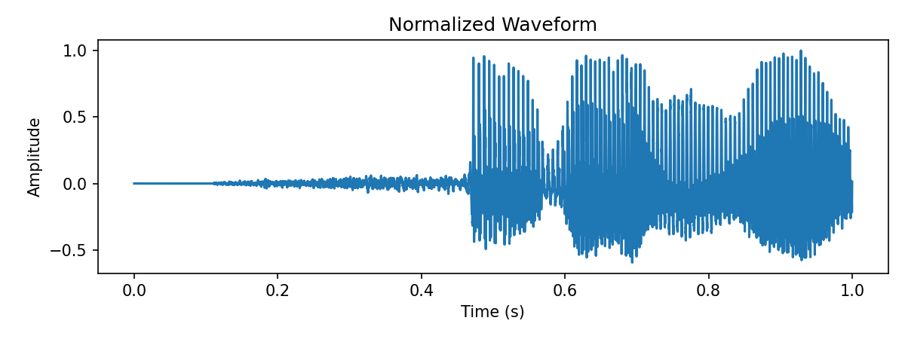
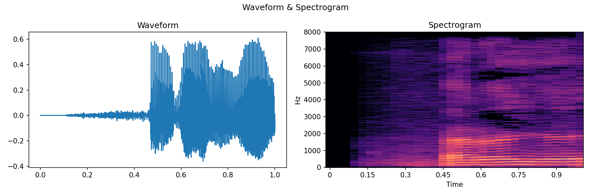
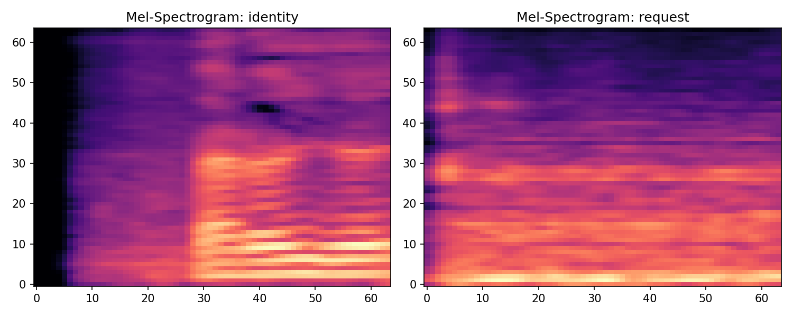
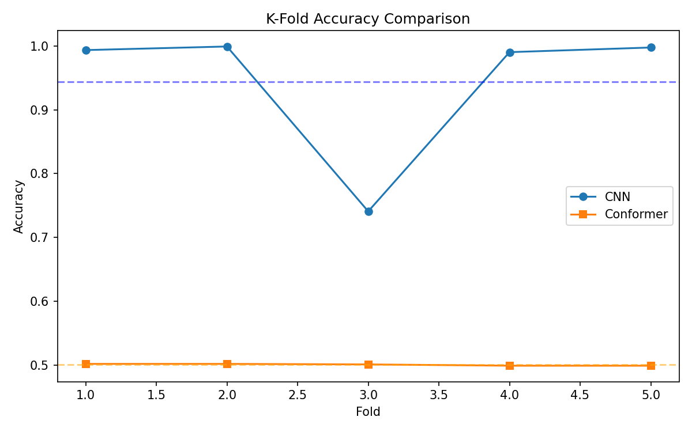
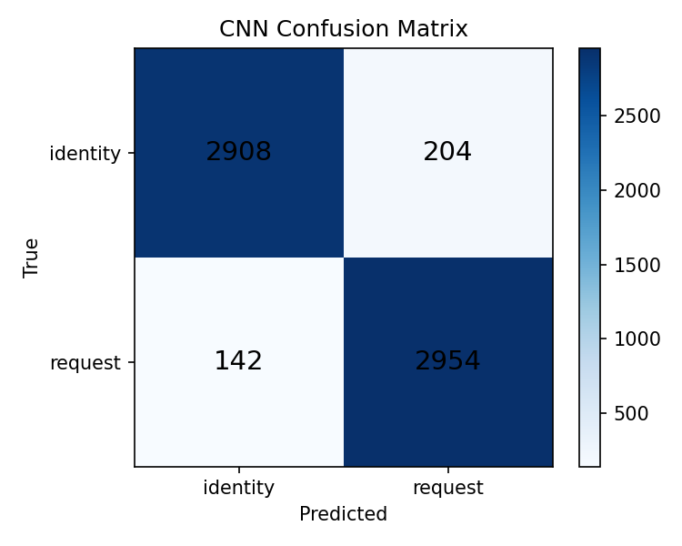
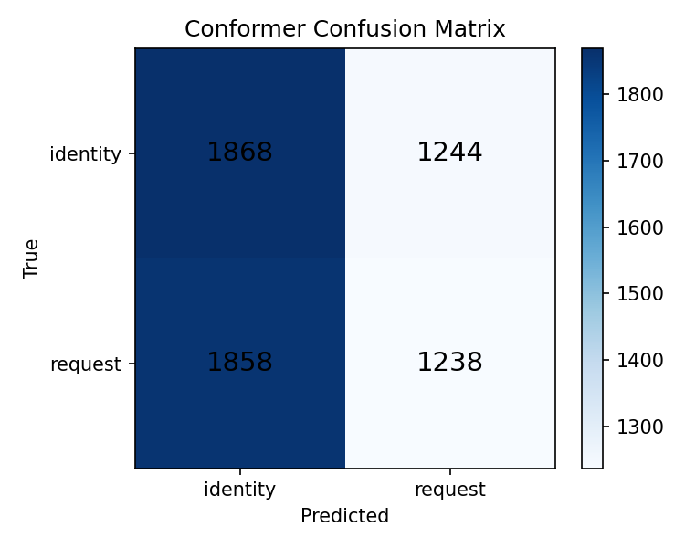

# 🎙️ Audio Classification: CNN vs. Conformer

### Comparing CNN and Conformer architectures for short-utterance audio intent classification

---

## 📌 Overview

This project compares two deep learning architectures — a **CNN baseline** and a **Conformer** (convolution + self-attention) — on a binary intent classification task: distinguishing **`identity`** utterances from **`request`** utterances in short (~1 second) speech clips.

The core question driving this work: *do attention-based architectures like Conformer, which dominate large-scale speech recognition, still hold an edge when training data is limited?* To find out, both models were trained on identical Mel-spectrogram inputs and evaluated under matched conditions — 5-fold stratified cross-validation, identical preprocessing, and a shared synthetic data augmentation pipeline (time-stretch, pitch-shift, noise injection, and gain/shift perturbations).

---

## 🗂️ Dataset

| Label | Description |
|---|---|
| `identity` | Speaker identification utterances |
| `request` | Request-type utterances |

Each recording is ~1 second long. To compensate for a small base dataset, every original sample was expanded via audio augmentation (15 augmented variants per file: time-stretching, pitch-shifting, noise, gain, and time-shift), and all audio was converted to **64×64 Mel-spectrograms** before being fed into either model.

---

## 🔊 Audio Processing Pipeline

**1. Waveform Normalization** — raw audio is normalized to stabilize amplitude across samples.

  

**2. Spectrogram Feature Extraction** — signals are converted from time domain to frequency domain.

  

**3. Class Spectrogram Comparison** — Mel-spectrogram patterns for each class, which give a sense of why a convolutional model can pick up discriminative local structure directly from the spectrogram image.

  

---

## 🧠 Model Architectures

### 🔹 CNN Baseline
A compact convolutional stack (3 conv blocks with batch norm and pooling, global average pooling, dense head) operating directly on Mel-spectrogram images.

### 🔹 Conformer
A custom Conformer block implementation — feed-forward + multi-head self-attention + gated depthwise convolution + feed-forward, following the standard Conformer macro-structure — stacked on top of a small convolutional front-end and reshaped into a sequence for the attention layers.

Both models were trained with identical hyperparameters (Adam optimizer, binary cross-entropy loss, 30 epochs, batch size 16) for a fair comparison.

---

## 📈 Results

### K-Fold Cross-Validation Accuracy

  

The CNN performed strongly across folds, averaging well above 90% accuracy (with one fold dipping lower, likely due to a harder train/validation split). The Conformer, under this same data budget, stayed close to chance level — a clear signal that, **on this dataset size, the Conformer needed more data** to learn a useful representation through its attention layers, rather than there being any fundamental flaw in the architecture itself.

### Confusion Matrices

  
  

The CNN's confusion matrix shows strong separation between the two classes. The Conformer's matrix reinforces the cross-validation result: with limited data, it wasn't able to learn a confident decision boundary between `identity` and `request`.

### Noise Robustness (SNR Sweep)

Both models were also tested under several Signal-to-Noise Ratio conditions to gauge behavior in noisy environments. Results in this setting were inconclusive at the data scale used here, so this is flagged as a direction for future work with a larger dataset and more controlled noise-evaluation protocol, rather than a finding to draw conclusions from.

---

## 💡 Key Takeaways

- On a small, augmented dataset, a simple CNN was the more *data-efficient* choice for this binary intent task.
- The Conformer's local-conv + self-attention design is built for scale — it likely needs a larger training set to reach its potential on this task.
- This comparison highlights a practical, often-overlooked tradeoff in applied ML: architecture choice should match data budget, not just task complexity.

---

## 🛠️ Tech Stack

- **Python** — core language
- **TensorFlow / Keras** — model building and training (custom Conformer block implementation)
- **Librosa** — audio loading, augmentation, and Mel-spectrogram extraction
- **NumPy / SciPy** — numerical computation, paired t-test for significance
- **Scikit-learn** — stratified K-fold cross-validation, confusion matrices
- **Matplotlib** — visualization

## 👩‍💻 Author

**Sheyda Asadi**
Data Science & Machine Learning

---

⭐ If you found this project useful, consider giving it a star!

