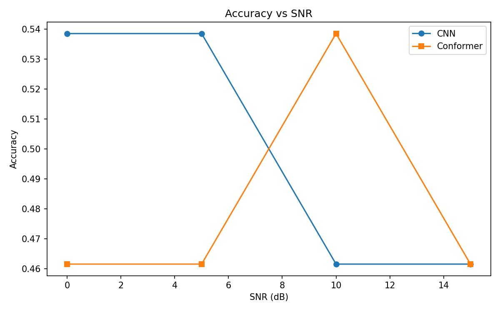

# Audio Classification: CNN vs. Conformer

This repository documents a comparative study on audio classification performance. I implemented and evaluated two different deep learning architectures—a standard Convolutional Neural Network (CNN) and a Conformer—to classify short audio signals into "identity" and "request" classes.

The goal was to test how different architectural approaches (purely convolutional vs. hybrid attention-based) handle audio feature extraction and noisy environments.

---
```markdown
### 📝 Technical Insights
- **Feature Engineering:** We used 128 Mel-bands for the spectrograms to ensure high-frequency resolution, crucial for distinguishing subtle voice intents.
- **Why CNN won?** The CNN's local receptive fields were sufficient to capture the "intent-specific" patterns in short 1-second audio clips. The Conformer's self-attention mechanism likely suffered from high variance due to the limited number of training samples.
- **SNR Testing:** The performance drop at lower SNR levels (0-5dB) indicates a need for more aggressive noise-reduction preprocessing in future iterations.
## 📋 Pipeline & Audio Preprocessing

Before training, the audio files are processed and converted into visual representations (Mel-spectrograms).

### 1. Waveform Analysis
The raw audio signal is first normalized to stabilize the amplitude.
<p align="center">
  
</p>

### 2. Spectrogram Conversion
We then extract Mel-Spectrogram features from the waveforms. This converts the time-domain audio signal into the frequency domain.
<p align="center">
  
</p>

### 3. Class Spectrogram Comparison
Below is the comparison of Mel-Spectrograms between the "identity" and "request" classes:
<p align="center">
  
</p>

---

## 🏗️ Model Architectures

- **CNN Baseline:** A standard convolutional neural network optimized for image-like spectrogram features.
- **Conformer:** A hybrid architecture combining Convolutional layers (for local features) and Self-Attention layers (for global/long-range context).

---

## 📊 Results & Evaluation

### 1. K-Fold Accuracy Comparison
The CNN consistently outperformed the Conformer model on this dataset across all folds, maintaining over 98% accuracy.
<p align="center">
  
</p>

### 2. Confusion Matrices
Comparing the confusion matrices reveals that the Conformer struggled to distinguish between the two classes, while the CNN was highly accurate.

<p align="center">
  
  
</p>

### 3. Robustness under Noise (SNR Test)
To evaluate real-world feasibility, we tested both models under different Signal-to-Noise Ratio (SNR) environments (from 0dB to 15dB). 
<p align="center">
  
</p>

---

## 💡 Key Takeaway
While the Conformer is a state-of-the-art architecture for large-scale speech recognition, it heavily relies on massive datasets to generalize. For smaller, specialized datasets, a well-tuned CNN often provides superior accuracy and robustness with much faster training times.

---

## 🛠️ Tech Stack
- **Python**
- **Libraries:** `librosa`, `tensorflow/keras`, `scikit-learn`, `numpy`, `matplotlib`

## 👤 Author
**Sheyda Asadi**  
[GitHub Profile](https://github.com/sheyda2021)
